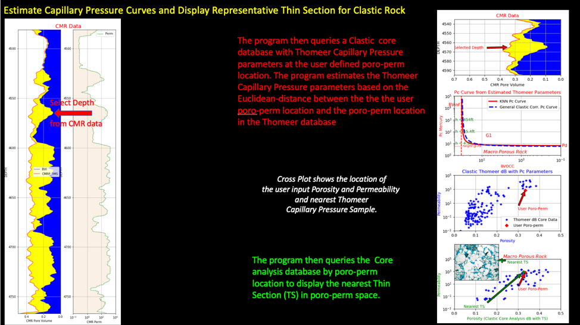

# Assess-Depth-Region-from-Depthplot-to-Generate-Core-Calibrated-Thin-Sections-and-Pc-Curves-from-norm
Assess a certain depth interval from a Depth Plot to estimate the Petrophysical properties for that interval

There are times when a Petrophysicist wants to assess a certain depth interval from a Depth Plot to estimate the Petrophysical properties for that interval. In this instance we select a depth location from an NMR log that is initially plotted as a Depth Plot, and then the program creates a widget with the Petrophysical estimations based on the core data. 

This repository utilizes normalized core data with distance-weighted estimations for only the KNN samples being considered. This program queries a clastic core analysis database having Thomeer Capillary Pressure parameters and another with links to a few available Thin Sections to generate a widget showing both an estimated Capillary Pressure curves and representative Thin Sections for a certain interval of the reservoir. The results are based entirely on the core data being employed that represents this clastic reservoir. This repository uses normalized core porosity and permeability data for the estimations based on KNN with Euclidean distances. 

The objective of this core integration project is to generate representative Petrophysical data for user defined porosity and permeability combinations (taken from depth plot) and is calibrated to the core reference data. Our reference data is a clastic core analysis database. The core analysis database being queried has porosity and permeability as well as the Thomeer-based Capillary Pressure parameters, BVi, Pdi and Gi used with each pore system i. There is also a core database with links to a few available Thin Sections based on their poro-perm relationships. 

For this repository we are using the inverse of the Euclidean distances for normalized porosity and permeability data to generate the distance-weighted KNN Thomeer Capillary Pressure parameters or the nearest representative Thin Section image based on the normalized poro-perm relationships of the data. This process is based on the Euclidean distance difference between the normalized core analysis reference poro-perm data vs. the normalized user defined poro-perm combination and the inverse of the n nearest Euclidean distances are the only values being used for the distance-weighted averages. 

